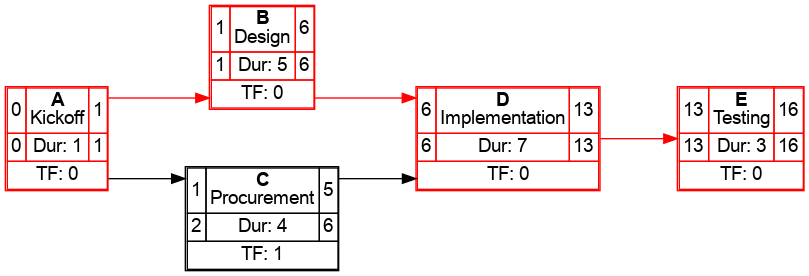

# CPM Network Diagram Generator

This project is a **Critical Path Method (CPM) network diagram generator** for project management.  
It reads activity data from a CSV file, computes scheduling metrics (ES, EF, LS, LF, TF), and produces a **clean network diagram** with critical paths highlighted.

The diagrams are rendered with [Graphviz](https://graphviz.org/) in a **grid-like layout** with orthogonal connectors.

---

## Features

- Computes:
  - **Earliest Start (ES)**
  - **Earliest Finish (EF)**
  - **Latest Start (LS)**
  - **Latest Finish (LF)**
  - **Total Float (TF)**
- Highlights the **critical path** (zero float) in red
- Outputs diagrams as **PNG, SVG, or PDF**
- Grid-based layout with square connectors for clarity
- Simple CSV input format

---

## Installation

We recommend using **conda** to manage the environment.

```bash
# Create a new environment
conda create -n cpm-diagram python=3.10 -y
conda activate cpm-diagram

# Install dependencies
pip install pandas graphviz
````

> Make sure you have the Graphviz binaries installed.
> On Ubuntu/Debian:
>
> ```bash
> sudo apt-get install graphviz
> ```
>
> On macOS (with Homebrew):
>
> ```bash
> brew install graphviz
> ```

---

## Usage

### 1. Prepare your CSV file

Example `project.csv`:

```csv
id,description,duration,predecessors
A,Kickoff,1,
B,Design,5,A
C,Procurement,4,A
D,Implementation,7,B,C
E,Testing,3,D
```

* `id`: Unique activity ID (letters/numbers)
* `description`: Short task description
* `duration`: Task duration in days
* `predecessors`: Comma-separated list of task IDs (leave blank if none)

---

### 2. Run the program

```bash
python cpm_network_diagram.py project.csv output.png
```

This generates `output.png` with the full CPM network diagram.

You can also output to **SVG** or **PDF** by changing the file extension:

```bash
python cpm_network_diagram.py project.csv output.svg
python cpm_network_diagram.py project.csv output.pdf
```

---

## Example Output

For the demo CSV above, the generated diagram looks like this:



---

## License

MIT License – feel free to use and adapt this tool in your own projects.
